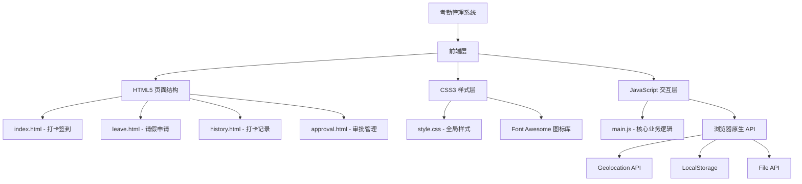

# 考勤管理系统 - 项目分析报告

## 1. 项目概述

本项目是一个基于纯前端技术栈开发的考勤管理系统，采用HTML/CSS/JavaScript构建，无需后端即可运行。系统提供了完整的员工考勤管理功能，包括打卡签到、请假申请、打卡记录查询和审批管理等核心模块，界面采用现代化的设计风格，支持响应式布局。

---

## 2. 技术架构图



### 2.1 项目目录结构

```
kaoqin/
├── index.html          # 打卡签到页面（首页）
├── leave.html          # 请假申请页面
├── history.html        # 打卡记录查询页面
├── approval.html       # 审批管理页面
├── css/
│   └── style.css       # 全局样式文件（约2168行）
└── js/
    └── main.js         # 核心业务逻辑（约541行）
```

### 2.2 各文件职责

| 文件 | 职责描述 |
|------|----------|
| `index.html` | 打卡签到主页面，包含打卡按钮、打卡方式选择、状态展示 |
| `leave.html` | 请假申请页面，包含假期余额展示、申请列表、新建申请弹窗 |
| `history.html` | 打卡记录页面，包含筛选功能、数据表格、日历视图 |
| `approval.html` | 审批管理页面，包含待办统计、审批列表、批量操作 |
| `style.css` | 全局样式定义，包含所有组件的样式和响应式设计 |
| `main.js` | 核心业务逻辑，包含所有交互功能和数据处理 |

---

## 3. 功能模块清单

| 模块名称 | 功能点 | 实现状态 | 技术实现 |
|----------|--------|----------|----------|
| **打卡签到** | 4种打卡方式（人脸/指纹/二维码/GPS） | ✅ 已实现 | 按钮切换 + 状态管理 |
| | 上班/下班打卡切换 | ✅ 已实现 | 状态变量控制 |
| | 实时时间显示 | ✅ 已实现 | setInterval定时器 |
| | GPS定位获取 | ✅ 已实现 | Geolocation API |
| | 工作时长自动计算 | ✅ 已实现 | Date对象计算 |
| | 打卡统计展示 | ✅ 已实现 | 静态数据展示 |
| **请假申请** | 6种请假类型 | ✅ 已实现 | 下拉选择框 |
| | 假期余额展示 | ✅ 已实现 | 卡片式布局 |
| | 日期范围选择 | ✅ 已实现 | input[type="date"] |
| | 请假天数自动计算 | ✅ 已实现 | JavaScript计算 |
| | 紧急请假标记 | ✅ 已实现 | Checkbox控件 |
| | 附件上传功能 | ✅ 已实现 | File API |
| | 申请状态筛选 | ✅ 已实现 | Tab切换 |
| | 申请撤销功能 | ✅ 已实现 | DOM操作 |
| **打卡记录** | 多维度筛选（时间/状态） | ✅ 已实现 | Select控件 |
| | 自定义日期范围 | ✅ 已实现 | 条件显示 |
| | 统计概览卡片 | ✅ 已实现 | Grid布局 |
| | 详细记录表格 | ✅ 已实现 | Table布局 |
| | 日历视图展示 | ✅ 已实现 | CSS Grid |
| | 数据导出功能 | ✅ 已实现 | 模拟导出 |
| | 分页功能 | ✅ 已实现 | 静态分页 |
| **审批管理** | 审批类型切换 | ✅ 已实现 | Tab切换 |
| | 待办统计卡片 | ✅ 已实现 | 状态统计 |
| | 批量通过/拒绝 | ✅ 已实现 | Checkbox选择 |
| | 审批历史时间线 | ✅ 已实现 | 时间线布局 |
| | 通知提醒 | ✅ 已实现 | 徽章提示 |

---

## 4. 技术栈分析

### 4.1 前端框架/库

| 技术 | 版本 | 用途 | 说明 |
|------|------|------|------|
| HTML5 | - | 页面结构 | 语义化标签，表单验证 |
| CSS3 | - | 样式表现 | CSS变量、Flexbox、Grid、动画 |
| JavaScript | ES6+ | 交互逻辑 | 原生JS，无框架依赖 |
| Font Awesome | 6.4.0 | 图标库 | CDN引入 |

### 4.2 CSS架构特点

```css
/* CSS变量系统 - 统一管理设计令牌 */
:root {
    --primary-color: #4f46e5;
    --success-color: #10b981;
    --warning-color: #f59e0b;
    --danger-color: #ef4444;
    --sidebar-width: 260px;
    --border-radius: 12px;
    --shadow: 0 1px 3px 0 rgba(0, 0, 0, 0.1);
    --transition: all 0.3s ease;
}
```

**架构特点：**
- **CSS变量系统**：使用`:root`定义设计令牌，便于主题切换
- **BEM命名规范**：组件化CSS类名（如`.checkin-status-card`）
- **响应式断点**：4个断点（1200px/992px/768px/480px）
- **Flexbox + Grid**：现代布局方式混合使用

### 4.3 JavaScript模块化方式

**当前实现：** 单文件全局函数模式

```javascript
// 全局变量管理状态
let currentCheckinStatus = 'out';
let checkinTime = null;
let checkoutTime = null;

// 全局函数定义
function handleCheckin() { ... }
function showNotification() { ... }
```

**特点分析：**
- ✅ 简单直观，易于理解
- ✅ 无构建工具依赖
- ❌ 全局命名空间污染
- ❌ 代码复用性受限
- ❌ 难以单元测试

### 4.4 第三方依赖

| 依赖 | 来源 | 用途 |
|------|------|------|
| Font Awesome 6.4.0 | CDN | 全站图标 |

**优点：** 零依赖，轻量级  
**缺点：** 功能受限，无现代开发工具链支持

---

## 5. UI/UX设计分析

### 5.1 页面布局结构

```
┌─────────────────────────────────────────────────┐
│  Sidebar (260px)    │  Main Content             │
│  ┌─────────────┐    │  ┌─────────────────────┐  │
│  │   Logo      │    │  │   Top Header        │  │
│  ├─────────────┤    │  │   (Title + Actions) │  │
│  │   Nav Menu  │    │  └─────────────────────┘  │
│  │   - 打卡    │    │  ┌─────────────────────┐  │
│  │   - 请假    │    │  │                     │  │
│  │   - 记录    │    │  │   Content Area      │  │
│  │   - 审批    │    │  │                     │  │
│  ├─────────────┤    │  │                     │  │
│  │  User Info  │    │  │                     │  │
│  └─────────────┘    │  └─────────────────────┘  │
└─────────────────────────────────────────────────┘
```

### 5.2 组件复用情况

| 组件 | 复用页面 | 复用次数 |
|------|----------|----------|
| 侧边导航栏 | 全部4页 | 4次 |
| 用户头像/信息 | 全部4页 | 4次 |
| 状态徽章 | index/leave/history | 多次 |
| 按钮样式 | 全部页面 | 多次 |
| 弹窗组件 | 全部页面 | 多次 |
| 时间线组件 | leave/approval | 2次 |

**复用方式：** 通过HTML模板复制，未使用组件化方案

### 5.3 交互设计特点

1. **即时反馈**
   - 打卡成功通知（右上角滑入）
   - 按钮悬停效果
   - 加载状态动画

2. **视觉层次**
   - 卡片阴影区分层级
   - 颜色编码状态（绿/黄/红）
   - 图标辅助识别

3. **动效设计**
   - 打卡按钮脉冲动画
   - 弹窗滑入动画
   - 页面切换过渡

### 5.4 响应式设计

| 断点 | 布局变化 |
|------|----------|
| ≤1200px | 统计网格2列、假期卡片2列 |
| ≤992px | 侧边栏隐藏、打卡方式2列 |
| ≤768px | 单列布局、表单堆叠 |
| ≤480px | 最小化布局、日历紧凑 |

---

## 6. 数据流分析

### 6.1 状态管理方式

**当前方案：** 全局变量 + DOM操作

```javascript
// 状态定义
let currentCheckinStatus = 'out';
let checkinTime = null;
let checkoutTime = null;

// 状态更新 → DOM更新
function handleCheckin() {
    currentCheckinStatus = 'in';
    document.getElementById('todayStatus').textContent = '工作中';
}
```

### 6.2 数据存储方式

| 数据类型 | 存储方式 | 持久化 |
|----------|----------|--------|
| 打卡状态 | 内存变量 | ❌ 页面刷新丢失 |
| 用户设置 | 未实现 | - |
| 历史记录 | 静态HTML | ❌ 无法动态更新 |
| 请假申请 | 静态HTML | ❌ 无法动态更新 |

**关键问题：** 无数据持久化机制，所有数据为静态演示数据

### 6.3 组件间通信

**通信方式：** 无，各页面独立

- 页面间通过链接跳转
- 无状态共享机制
- 无事件总线

---

## 7. 核心代码解析

### 7.1 打卡核心函数

```javascript
// 处理打卡逻辑
function handleCheckin() {
    const now = new Date();
    const timeString = now.toLocaleTimeString('zh-CN', { hour12: false });
    
    if (currentCheckinStatus === 'out') {
        // 上班打卡
        checkinTime = now;
        currentCheckinStatus = 'in';
        document.getElementById('checkInTime').textContent = timeString;
        document.getElementById('todayStatus').textContent = '工作中';
        showNotification('上班打卡成功！', 'success');
    } else {
        // 下班打卡
        checkoutTime = now;
        currentCheckinStatus = 'out';
        document.getElementById('checkOutTime').textContent = timeString;
        const duration = calculateDuration(checkinTime, checkoutTime);
        document.getElementById('workDuration').textContent = duration;
        showNotification('下班打卡成功！', 'success');
    }
}
```

**分析：**
- ✅ 状态切换逻辑清晰
- ✅ 时间格式化规范
- ✅ 用户反馈及时
- ❌ 无数据持久化
- ❌ 无重复打卡校验

### 7.2 通知系统

```javascript
function showNotification(message, type = 'info') {
    const notification = document.createElement('div');
    notification.className = `notification notification-${type}`;
    notification.innerHTML = `...`;
    notification.style.cssText = `...`;
    document.body.appendChild(notification);
    
    setTimeout(() => {
        notification.style.animation = 'slideOut 0.3s ease';
        setTimeout(() => notification.remove(), 300);
    }, 3000);
}
```

**分析：**
- ✅ 动态创建DOM，无需预定义
- ✅ 自动清理，避免内存泄漏
- ✅ 支持多种类型
- ❌ 样式内联，难以维护

### 7.3 请假天数计算

```javascript
function calculateLeaveDays() {
    const startDate = document.getElementById('startDate');
    const endDate = document.getElementById('endDate');
    const leaveDays = document.getElementById('leaveDays');
    
    if (startDate && endDate && leaveDays && startDate.value && endDate.value) {
        const start = new Date(startDate.value);
        const end = new Date(endDate.value);
        
        if (end >= start) {
            const diffTime = Math.abs(end - start);
            const diffDays = Math.ceil(diffTime / (1000 * 60 * 60 * 24)) + 1;
            leaveDays.value = diffDays + '天';
        }
    }
}
```

**分析：**
- ✅ 边界校验（end >= start）
- ✅ 自动计算含首尾
- ❌ 未排除周末/节假日

---

## 8. 代码质量评估

### 8.1 代码组织结构

| 维度 | 评分 | 说明 |
|------|------|------|
| 文件组织 | ⭐⭐⭐⭐ | 目录结构清晰 |
| 代码分层 | ⭐⭐⭐ | 无明确分层，混合在一起 |
| 模块化 | ⭐⭐ | 单文件，函数级复用 |
| 可扩展性 | ⭐⭐ | 新增功能需修改多处 |

### 8.2 命名规范

| 类型 | 规范 | 示例 |
|------|------|------|
| CSS类名 | BEM风格 | `.checkin-status-card` |
| JS函数 | 驼峰命名 | `handleCheckin()` |
| 变量 | 驼峰命名 | `currentCheckinStatus` |
| ID命名 | 驼峰命名 | `checkInTime` |

**评价：** 命名规范统一，语义清晰

### 8.3 注释完整性

| 文件 | 注释情况 |
|------|----------|
| main.js | 有函数级注释，但缺少JSDoc |
| style.css | 有区块注释 |
| HTML | 有结构注释 |

**评价：** 基础注释足够，但缺少详细文档

### 8.4 可维护性

**优点：**
- CSS变量便于主题调整
- 函数职责单一
- 选择器语义清晰

**缺点：**
- 代码重复（4个页面有相同侧边栏代码）
- 无错误处理机制
- 硬编码数据
- 无单元测试

---

## 9. 改进建议

### 9.1 架构层面

| 优先级 | 建议 | 预期收益 |
|--------|------|----------|
| 🔴 高 | 引入前端框架（Vue/React） | 提升开发效率，组件复用 |
| 🔴 高 | 添加后端API | 数据持久化，多用户支持 |
| 🟡 中 | 使用构建工具（Vite/Webpack） | 代码压缩，模块化管理 |
| 🟡 中 | 引入状态管理（Pinia/Redux） | 统一状态管理 |
| 🟢 低 | 添加TypeScript | 类型安全，IDE支持 |

### 9.2 功能层面

| 优先级 | 建议 | 说明 |
|--------|------|------|
| 🔴 高 | 数据持久化 | 使用localStorage或IndexedDB |
| 🔴 高 | 用户认证 | 登录/权限控制 |
| 🟡 中 | 数据导出真实实现 | 生成Excel/PDF |
| 🟡 中 | 日历功能完善 | 真实日期计算，节假日标注 |
| 🟢 低 | 图表统计 | 使用ECharts展示趋势 |

### 9.3 代码层面

| 优先级 | 建议 | 说明 |
|--------|------|------|
| 🔴 高 | 提取公共组件 | 侧边栏、弹窗等提取为组件 |
| 🔴 高 | 添加错误处理 | try/catch，用户提示 |
| 🟡 中 | 代码分割 | 按页面分割JS文件 |
| 🟡 中 | 添加ESLint/Prettier | 代码规范自动化 |
| 🟢 低 | 添加单元测试 | Jest/Vitest |

### 9.4 UI/UX层面

| 优先级 | 建议 | 说明 |
|--------|------|------|
| 🟡 中 | 深色模式 | 使用CSS变量实现 |
| 🟡 中 | 骨架屏 | 提升加载体验 |
| 🟢 低 | 动画优化 | 使用CSS transform |
| 🟢 低 | 无障碍支持 | ARIA标签，键盘导航 |

---

## 10. 总结

### 项目亮点

1. **设计精美**：现代化的UI设计，配色和谐，视觉效果佳
2. **功能完整**：覆盖了考勤管理的核心业务流程
3. **响应式适配**：多设备适配良好
4. **零依赖**：纯原生技术实现，加载速度快
5. **交互友好**：即时反馈，动效流畅

### 主要问题

1. **无数据持久化**：所有数据为静态，刷新即丢失
2. **代码复用率低**：相同结构复制多份
3. **无后端支持**：无法实现真实业务场景
4. **可维护性一般**：单文件代码量大

### 适用场景

- ✅ 前端技术演示/学习
- ✅ UI设计原型展示
- ✅ 小型团队内部工具（配合本地存储）
- ❌ 生产环境企业级应用

### 技术债务评估

| 债务类型 | 严重程度 | 解决成本 |
|----------|----------|----------|
| 代码重复 | 中 | 低 |
| 无测试 | 中 | 中 |
| 无类型系统 | 低 | 中 |
| 无构建流程 | 中 | 低 |

---

**报告生成时间：** 2026-04-13  
**分析工具：** 人工代码审查  
**代码版本：** 当前工作目录版本
