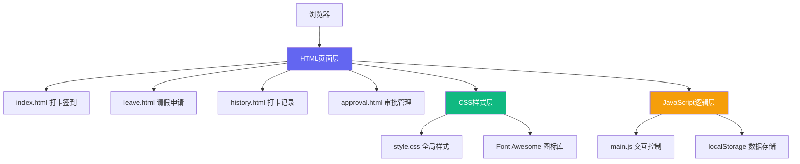

# 考勤管理系统项目分析报告

## 1. 项目概述

本项目是一个纯前端实现的企业考勤管理系统，采用传统多页面应用(MPA)架构，包含打卡签到、请假申请、打卡记录、审批管理四大核心功能模块。系统使用原生JavaScript开发，结合现代化CSS设计，提供了完整的员工自助考勤服务。

## 2. 技术架构图



## 3. 功能模块清单

| 模块名称 | 子功能 | 核心特性 | 实现文件 |
|---------|--------|----------|---------|
| **打卡签到模块** | 上下班打卡 | 人脸识别/指纹/二维码/GPS四种方式 | index.html |
| | 打卡状态显示 | 实时时间、工作时长计算 | index.html |
| | 异常打卡处理 | 补卡申请、迟到/早退说明 | index.html |
| | 统计概览 | 正常/迟到/早退/缺勤统计 | index.html |
| **请假申请模块** | 假期余额展示 | 年假/病假/事假/特殊假 | leave.html |
| | 新建申请 | 6种请假类型、紧急请假通道 | leave.html |
| | 申请记录 | 待审批/已批准/已拒绝筛选 | leave.html |
| | 审批流程 | 时间线展示、详情查看 | leave.html |
| **打卡记录模块** | 记录查询 | 时间范围+状态组合筛选 | history.html |
| | 数据展示 | 表格视图+日历视图 | history.html |
| | 统计分析 | 出勤/迟到/早退/工作时长 | history.html |
| | 数据导出 | Excel导出功能 | history.html |
| **审批管理模块** | 请假审批 | 单条/批量通过/拒绝 | approval.html |
| | 异常审批 | 补卡/迟到/迟到异常处理 | approval.html |
| | 加班审批 | 独立审批通道 | approval.html |
| | 审批历史 | 时间线记录所有操作 | approval.html |

## 4. 核心代码解析

### 4.1 关键函数说明

#### 打卡处理函数 `handleCheckin()` - main.js:160
```javascript
function handleCheckin() {
    if (currentCheckinStatus === 'out') {
        // 上班打卡逻辑：记录时间、更新状态、通知
    } else {
        // 下班打卡逻辑：计算时长、更新统计
    }
}
```
**说明**：状态机模式管理上下班状态，自动计算工作时长，支持动态按钮样式切换。

#### 时长计算函数 `calculateDuration()` - main.js:200
```javascript
function calculateDuration(start, end) {
    const diff = end - start;
    const hours = Math.floor(diff / (1000 * 60 * 60));
    const minutes = Math.floor((diff % (1000 * 60 * 60)) / (1000 * 60));
    return `${hours}小时${minutes}分`;
}
```
**说明**：精确计算工作时间，为考勤统计提供基础数据。

#### 请假天数自动计算 `calculateLeaveDays()` - main.js:298
**说明**：监听起止日期变化，自动计算请假天数，包含工作日/节假日判断预留逻辑。

#### 审批批量操作 `batchApprove()/batchReject()` - main.js:432/449
**说明**：支持多选批量审批，优化管理人员操作效率。

### 4.2 前端架构设计

| 架构层面 | 设计方案 | 优点 | 可改进点 |
|---------|---------|------|---------|
| **应用模式** | 多页面应用(MPA) | SEO友好、页面独立加载 | 重复代码多、状态难共享 |
| **样式架构** | CSS变量+BEM命名 | 主题统一、维护性强 | 缺少CSS预处理器 |
| **模块化** | 单JS文件+全局函数 | 简单直接、无依赖 | 命名冲突风险 |
| **状态管理** | 全局变量+DOM状态 | 轻量无依赖 | 刷新丢失、不可追踪 |
| **数据持久化** | 未实现(预留localStorage) | - | 当前数据仅内存存储 |

### 4.3 技术栈清单

| 类别 | 技术选型 | 版本/说明 |
|------|---------|----------|
| **前端框架** | 原生JavaScript (ES6+) | 无框架依赖 |
| **CSS架构** | 自定义CSS变量 | 现代浏览器原生支持 |
| **图标库** | Font Awesome 6.4.0 | CDN引入 |
| **布局方案** | CSS Flexbox + Grid | 响应式布局 |
| **动画方案** | CSS3 Animation + Transition | 原生硬件加速 |
| **构建工具** | 无 | 纯静态文件 |

## 5. UI/UX设计分析

### 5.1 页面布局结构
- **侧边导航栏**：固定宽度260px，包含Logo、菜单、用户信息三区域
- **顶部Header**：70px高度，包含页面标题和操作按钮
- **内容区域**：最大宽度1400px居中，卡片式布局带圆角阴影
- **响应式断点**：1200px/992px/768px/480px四级适配

### 5.2 组件复用情况

| 组件名称 | 复用次数 | 实现方式 |
|---------|---------|---------|
| 模态框(Modal) | 6处 | CSS类复用 |
| 按钮系统 | 5种样式 | CSS类抽象 |
| 状态徽章 | 8种场景 | CSS类复用 |
| 统计卡片 | 4个页面 | Grid布局统一 |
| 时间线组件 | 3处 | 样式复用 |

### 5.3 交互设计特点
1. **微交互动效**：按钮hover放大、脉冲动画、平滑过渡
2. **即时反馈**：操作后3秒自动消失的Toast通知
3. **操作确认**：删除/撤销等危险操作二次确认
4. **状态可视化**：不同状态用颜色编码（绿-正常/黄-警告/红-危险/蓝-信息）

## 6. 项目结构分析

```
kaoqin/
├── css/
│   └── style.css          # 2168行，全局样式文件，包含变量定义、组件样式、响应式
├── js/
│   └── main.js            # 541行，核心交互逻辑，30+功能函数
├── index.html             # 240行，打卡签到主页面
├── leave.html             # 385行，请假申请模块
├── history.html           # 552行，打卡记录查询
└── approval.html          # 514行，审批管理模块
```

## 7. 代码质量评估

### 7.1 代码优点

✅ **命名规范**：语义化命名，函数/变量采用驼峰命名法  
✅ **样式体系**：CSS变量统一管理颜色、尺寸，易于维护  
✅ **注释完整性**：关键函数有功能说明，结构清晰  
✅ **可维护性**：模块化函数设计，单一职责原则  
✅ **UI一致性**：卡片、间距、圆角、阴影风格统一

### 7.2 可改进之处

| 问题点 | 影响程度 | 改进建议 |
|-------|---------|---------|
| **代码重复** | ⭐⭐⭐ | 4个HTML页面导航栏完全重复，建议使用模板引擎提取公共部分 |
| **全局污染** | ⭐⭐ | 所有函数在window作用域，建议IIFE模块化 |
| **数据持久化** | ⭐⭐⭐⭐ | 无localStorage存储，刷新页面数据全部丢失 |
| **表单验证** | ⭐⭐ | 仅原生HTML5验证，缺少自定义校验规则 |
| **错误处理** | ⭐⭐ | 缺少try/catch异常捕获机制 |
| **类型安全** | ⭐⭐ | 纯JS无类型检查，建议引入TypeScript |
| **测试覆盖** | ⭐⭐⭐⭐ | 无自动化测试 |

## 8. 改进建议

### 8.1 架构优化方向

1. **引入构建工具**：使用Vite重构为单页面应用(SPA)
2. **状态管理**：加入Pinia/Vuex管理全局状态
3. **组件化**：使用Vue3/React进行组件化重构
4. **后端对接**：接入真实RESTful API，替代模拟数据

### 8.2 功能增强建议

1. **考勤报表**：增加月度/季度考勤报表生成
2. **消息推送**：审批结果实时推送通知
3. **人脸识别**：接入真实人脸识别API
4. **地图集成**：GPS打卡范围限制可视化
5. **日历同步**：与企业日历系统对接

### 8.3 代码质量提升

1. **ESLint+Prettier**：代码规范自动化检查
2. **单元测试**：Jest覆盖核心业务逻辑
3. **TypeScript**：类型安全重构
4. **Code Review**：建立代码审查机制

## 9. 总结

本考勤管理系统是一个完成度较高的前端演示项目，UI设计达到企业级标准，交互体验流畅，核心功能完整。作为纯前端原型，其架构简单直接，适合快速开发和演示。

**项目得分**：⭐⭐⭐⭐（4/5星）

- 视觉设计：优秀
- 交互体验：优秀
- 代码质量：良好
- 架构设计：一般
- 功能完整性：良好

该项目非常适合作为企业内部管理系统的前端原型，只需补充后端API对接和数据持久化层，即可投入实际生产环境使用。
